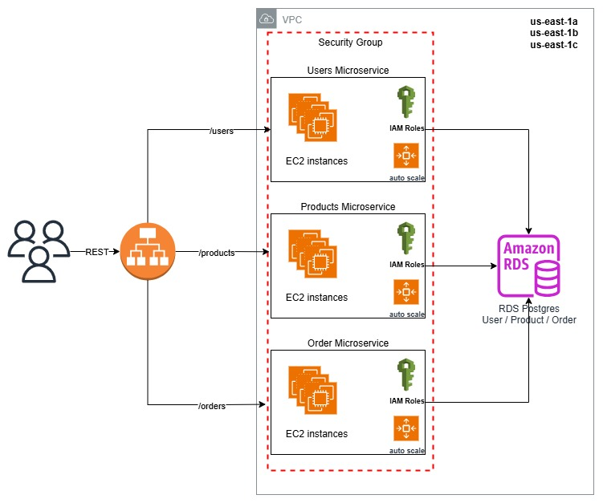

# Infraestrutura Desafio Final Bootcamp Arquitetura de Soluções - Guia de Uso



## Passo a passo para construir a infraestrutura

1. **Pré-requisitos**
   - Tenha o [Terraform](https://www.terraform.io/downloads.html) instalado.
   - Configure suas credenciais AWS (via `aws configure` ou variáveis de ambiente).
   - Gere uma key pair no serviço de EC2 no console da aws e altere nos script de autoscaling.tf
   - Clone este repositório e acesse a pasta `aws-infra`.

2. **Inicialize o Terraform**
   ```sh
   terraform init
   ```

3. **Valide a configuração**
   ```sh
   terraform validate
   ```

4. **Veja o plano de execução**
   ```sh
   terraform plan
   ```

5. **Aplique a infraestrutura**
   ```sh
   terraform apply
   ```
   Confirme digitando `yes` quando solicitado.

---

### main.tf
- **O que faz:**
  - Define o provedor AWS e a região.
  - Cria uma VPC customizada usando o módulo oficial da AWS, com sub-redes públicas e privadas, NAT Gateway e tags de ambiente.
- **Por quê:**
  - Segrega recursos em sub-redes públicas/privadas para maior segurança e flexibilidade.
  - O NAT Gateway permite que instâncias em sub-redes privadas acessem a internet sem ficarem expostas.

### alb.tf
- **O que faz:**
  - Cria um Application Load Balancer (ALB) público.
  - Define três Target Groups (users, products, orders) e listeners para rotear requisições HTTP conforme o caminho.
  - Cria regras para encaminhar `/users*`, `/products*` e `/orders*` para os respectivos grupos.
- **Por quê:**
  - O ALB distribui o tráfego entre as instâncias EC2 de cada serviço, garantindo alta disponibilidade e escalabilidade.
  - As regras de path permitem separar o tráfego de cada microserviço.

### autoscaling.tf
- **O que faz:**
  - Cria três Launch Templates (users, products, orders) que definem a configuração das instâncias EC2 (AMI, tipo, user_data, etc).
  - Cria três Auto Scaling Groups, um para cada serviço, garantindo no mínimo 3 instâncias e até 6, conforme demanda.
- **Por quê:**
  - O Auto Scaling garante alta disponibilidade e escalabilidade automática dos serviços.
  - O uso de Launch Templates padroniza a configuração das instâncias.

### iam.tf
- **O que faz:**
  - Cria uma role IAM para EC2 acessar o RDS.
  - Anexa a política AmazonRDSFullAccess à role.
- **Por quê:**
  - Permite que as instâncias EC2 dos serviços acessem o banco de dados RDS de forma segura e controlada.

### rds.tf
- **O que faz:**
  - Cria um banco de dados PostgreSQL (RDS) compartilhado entre os serviços.
  - Define subnets, security group, backup, criptografia e proteção contra deleção.
- **Por quê:**
  - Centraliza o armazenamento dos dados dos serviços.
  - Garante alta disponibilidade (multi-AZ), segurança e backups automáticos.

### security_groups.tf
- **O que faz:**
  - Cria um Security Group para as instâncias EC2, liberando acesso HTTP (porta 80) e saída irrestrita.
- **Por quê:**
  - Controla o tráfego de entrada e saída das instâncias, aumentando a segurança.

### variables.tf
- **O que faz:**
  - Define variáveis reutilizáveis para IDs de VPC, subnets, credenciais do banco, caminhos de scripts de inicialização, etc.
- **Por quê:**
  - Facilita a customização e reutilização dos recursos.

### Scripts de inicialização (user_data_*.sh)
- **O que fazem:**
  - Cada script apenas grava uma mensagem de teste em `/tmp/` para indicar que a instância subiu corretamente.
- **Por quê:**
  - São placeholders para comandos de inicialização reais. Podem ser substituídos por scripts que instalam e configuram os serviços de cada microserviço.

---

## Observações
- Todos os recursos são criados na região `us-east-1`.
- O banco de dados, ALB e Auto Scaling são compartilhados entre os três microserviços (users, products, orders).
- Para destruir a infraestrutura, use:
  ```sh
  terraform destroy
  ```
